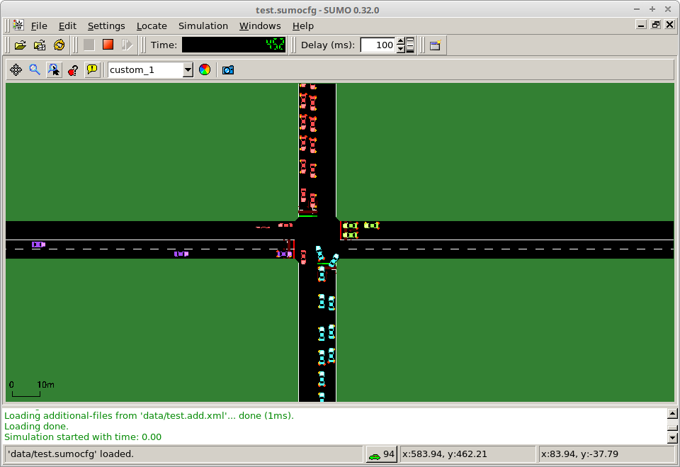

# Reinforcement Learning Intersection Controller
Implementation in Python of our SQN (Shallow Q-Network) algorithm for training a neural network using reinforcement learning and testing it in the simulator called SUMO. The network was used to control a simulated road intersection in real time. The results of the project were published in a research paper. During the research we also implemented a number of other algorithms such as actor-critic methods with continuous actions, but they turned out to be inferior to SQN in performance.

Published paper can be found here: https://doi.org/10.1109/ICECCO.2018.8634692

The repository includes the presentation I gave during my Bachelor’s thesis defense.

  
*Fig. 1: SUMO running a simulation of a single road intersection.*

  
*Vid. 1: Presentation of the project*

  
*Vid. 2: Live demo*
